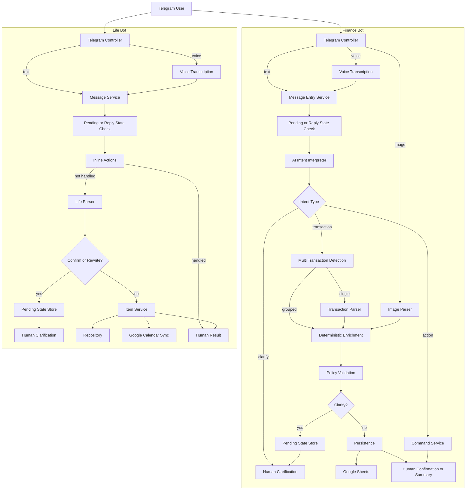

# Bot Pipelines

This document explains the current end-to-end processing flow for both bots.

- Image asset: [bot-pipelines.svg](/home/fairuz/Documents/learn/bot-finance-telegram/docs/assets/bot-pipelines.svg)

## Finance Bot

High-level flow:

1. Telegram controller receives text, voice, or image.
2. Voice is transcribed first.
3. Message entry service checks setup mode and pending confirmation state.
4. AI intent interpreter decides whether the message is:
   - a new transaction
   - edit
   - delete
   - summary
   - comparison
   - budget/read command
   - clarification
5. If the intent is an action, command service executes it.
6. If the intent is a transaction, the bot runs multi-transaction detection or single-transaction parsing.
7. Deterministic enrichment resolves dates, learned mappings, and normalization.
8. Policy validation decides whether to:
   - ask for clarification
   - save immediately
9. Persistence writes the transaction to Google Sheets and updates bot state.
10. The bot returns a human-readable confirmation or summary.

Core files:

- Entry flow: [message_entry_service.py](/home/fairuz/Documents/learn/bot-finance-telegram/src/bot_platform/bots/finance/application/message_entry_service.py:1)
- Unified extraction schema: [extraction.py](/home/fairuz/Documents/learn/bot-finance-telegram/src/bot_platform/bots/finance/domain/extraction.py:1)
- Unified extraction prompt: [finance_message_extractor.txt](/home/fairuz/Documents/learn/bot-finance-telegram/src/bot_platform/bots/finance/prompts/finance_message_extractor.txt:1)
- Command execution: [command_service.py](/home/fairuz/Documents/learn/bot-finance-telegram/src/bot_platform/bots/finance/application/command_service.py:1)
- Transaction enrichment/querying: [transaction_query_service.py](/home/fairuz/Documents/learn/bot-finance-telegram/src/bot_platform/bots/finance/application/transaction_query_service.py:1)
- Save/clarification policy: [policies.py](/home/fairuz/Documents/learn/bot-finance-telegram/src/bot_platform/bots/finance/domain/policies.py:1)

## Life Bot

High-level flow:

1. Telegram controller receives text or voice.
2. Voice is transcribed first.
3. Message service checks reply context and pending parse/confirmation state.
4. Inline actions are handled first:
   - done
   - snooze
   - cancel
   - view
   - edit
5. If the message is not an inline action, the AI parser or deterministic parser extracts life items.
6. The bot decides whether the result needs confirmation or manual rewrite.
7. If confirmed, item service saves the item and optionally syncs to Google Calendar.
8. The bot returns a human-readable result.

Core files:

- Entry flow: [message_service.py](/home/fairuz/Documents/learn/bot-finance-telegram/src/bot_platform/bots/life/application/message_service.py:1)
- Item actions: [item_service.py](/home/fairuz/Documents/learn/bot-finance-telegram/src/bot_platform/bots/life/application/item_service.py:1)
- Rendering: [rendering.py](/home/fairuz/Documents/learn/bot-finance-telegram/src/bot_platform/bots/life/application/rendering.py:1)

## Mermaid

